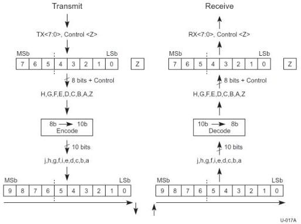
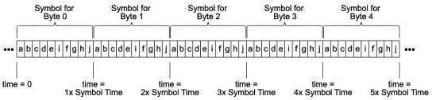

Revision 1.1
June 2022

- 57 -

Universal Serial Bus 3.2
Specification

Figure 6-7. Character to Symbol Mapping

### 6.3.1.1 Serialization and Deserialization of Data

The bits of a Symbol are placed starting with bit "a" and ending with bit "j." This is shown in Figure 6-8.

Figure 6-8. Bit Transmission Order

### 6.3.1.2 Normative 8b/10b Decode Rules for Gen 1 Operation

1. A Transmitter is permitted to pick any disparity when first transmitting differential data after being in an Electrical Idle state. The Transmitter shall then follow proper 8b/10b encoding rules until the next Electrical Idle state is entered.
2. The initial disparity for a Receiver is the disparity of the first Symbol used to obtain Symbol lock.
3. Disparity may also be-reinitialized if Symbol lock is lost and regained during the transmission of differential information due to a burst error event.

Copyright © 2022 USB 3.0 Promoter Group. All rights reserved.