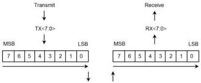

Revision 1.1
June 2022

- 59 -

Universal Serial Bus 3.2
Specification

# IMPLEMENTATION NOTE

# Disabling Scrambling

Disabling scrambling is intended to help simplify test and debug equipment. Control of the exact data patterns is useful in a test and debug environment. Since scrambling is reset at the physical layer, there is no reasonable way to reliably control the state of the data transitions through software. The Disable Scrambling bit is provided in the training sequence for this purpose.

The mechanism(s) and/or interface(s) used to notify the physical layer to disable scrambling is component implementation specific and beyond the scope of this specification.

For more information on scrambling, refer to Appendix B.

# 6.3.1.4 8b/10b Decode Errors for Gen 1 Operation

An 8b/10b Decode error shall occur when a received Symbol does not match any of the valid 8b/10b Symbols listed in Appendix A. Any received 8b/10b Symbol that does not match any of the valid 8b/10b Symbols listed in Appendix A shall be forwarded to the link layer by substituting a K28.4 symbol (refer to Table 6-2). 8b/10b errors may not directly initiate Recovery.

# 6.3.2 Gen 2 Encoding

A Gen 2 link, operating at 10 Gbps, shall use the encoding rules described in this subsection. The encoding is a scrambled 128b/132b encoding.

# 6.3.2.1 Serialization and Deserialization of Data

Data is serialized and transmitted from LSB to MSB as shown below. For Gen 2 operation a Symbol is defined to be 1 byte of information that may or may not be scrambled according to the scrambling rules.

Figure 6-10. Gen 2 Serialization and Deserialization Order

Copyright © 2022 USB 3.0 Promoter Group. All rights reserved.