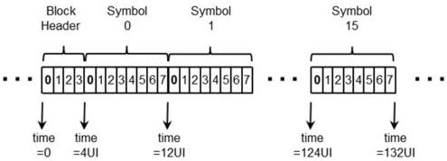

Revision 1.1
June 2022

- 60 -

Universal Serial Bus 3.2
Specification

Figure 6-11. Gen 2 Bit Transmission Order and Framing

### 6.3.2.2 Normative 128b/132b Decode Rules

The physical layer shall encode the data on a per block basis. Each block, except for the SKP Ordered Set control block, shall comprise a 4-bit Block Header and a 128-bit payload. The SKP Ordered Set control block shall be comprised of a 4-bit Block Header and a 192-bit payload. The 4-bit header is set to 0011b for data and 1100b for control blocks. This header format allows for the correction of single bit errors in the header information.

Ordered sets are control blocks, and all data is sent in data blocks. The following is a list of the control blocks.

- TS1 Ordered Set
- TS2 Ordered Set
- TSEQ Ordered Set
- SYNC Ordered Set
- SKP Ordered Set
- SDS Ordered Set

### 6.3.2.3 Data Scrambling for Gen 2 Operation

The scrambler used for Gen 2 operation is different than the scrambler used for Gen 1 operation. The LFSR uses the following polynomial: $$G(X) = X^{23} + X^{21} + X^{16} + X^8 + X^5 + X^2 + 1$$.

The scrambler has the following modes of operation:

1. The scrambler advances and is XORed with the data.
2. The scrambler advances and is bypassed (not XORed with the data).
3. The scrambler does not advance and is bypassed (not XORed with the data).

The scrambling rules are as follows:

1. The 4 bits of the Block Header bypass and do not advance the scrambler.
2. TS1, TS2 and TSEQ:
   a. Symbol 0 of a TS1, TS2, or TSEQ Ordered Set bypass and advances the scrambler.
   b. Symbols 1 to 13 are scrambled.

Copyright © 2022 USB 3.0 Promoter Group. All rights reserved.