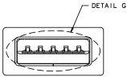
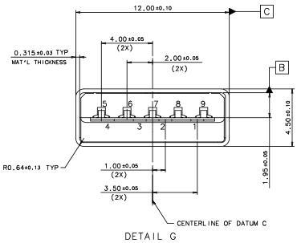

Mechanical

Figure 5-4. USB 3.1 Standard-A Plug Interface Dimensions

### 5.3.1.2 USB 3.1 Standard-A Reference Footprints

This specification does not define standard footprints. Any footprint may be used as long as all mechanical and electrical requirements are met. Example footprints are provided for reference only.

Figure 5-5 shows through-hole example footprints for the USB 3.1 Standard-A receptacle with a back-shield. Pin numbers are marked.

Figure 5-6 shows an example footprint for a mid-mount standard mount (mounted on the top of the PCB) Standard-A receptacle that includes Insertion Detect.

5-13