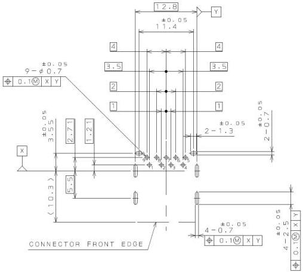

Universal Serial Bus 3.1 Specification, Revision 1.0

Figure 5-7 shows an example mid-mount reverse mount (mounted on the bottom of the PCB) with Insertion Detect. The reverse mount configuration locates the SuperSpeed signals between the USB 2.0 signals and the PCB edge, making the SuperSpeed signal routing more challenging. See Section 5.6.1.2 for target characteristic impedance.

PCB LAYOUT (REF.)
(STANDARD MOUNT TYPE)

Continued on next page

5-14