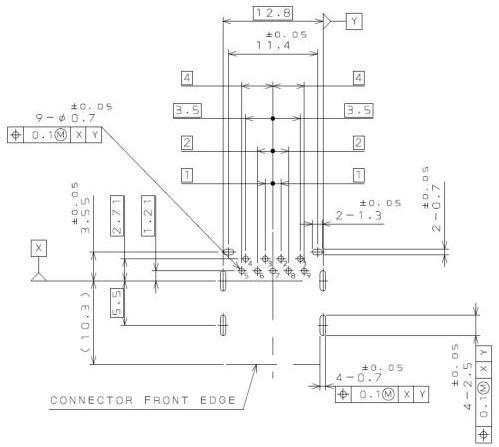

Universal Serial Bus 3.1 Specification, Revision 1.0

PCB LAYOUT (REF.)
(REVERSE MOUNT TYPE)

Figure 5-5. Example Footprint for the USB 3.1 Standard-A Receptacle - Through-Hole with Back-Shield

5-16