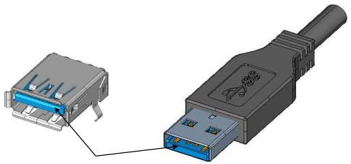

Universal Serial Bus 3.1 Specification, Revision 1.0

### 5.3.1.4 USB 3.1 Standard-A Connector Color Coding

Since both the USB 2.0 Standard-A and USB 3.1 Standard-A receptacles may co-exist on a host, color coding is recommended for the USB 3.1 Standard-A connector (receptacle and plug) housings to help users distinguish it from the USB 2.0 Standard-A connector.

Blue (Pantone 300C) is the recommended color for the USB 3.1 Standard-A receptacle and plug plastic housings. When the recommended color is used, connector manufacturers and system integrators should make sure that the blue-colored receptacle housing is visible to users. Figure 5-8 illustrates the color coding recommendation for the USB 3.1 Standard-A connector.

Figure 5-8. Illustration of Color Coding Recommendation for USB 3.1 Standard-A Connector

### 5.3.2 USB 3.1 Standard-B Connector

#### 5.3.2.1 Interface Definition

Figure 5-9, Figure 5-10, and Figure 5-11 show the USB Standard-B receptacle dimensions, the USB Standard-B plug dimensions, and a USB Standard-B receptacle reference footprint, respectively. See Section 5.6.1.2 for target characteristic impedance.

5-20