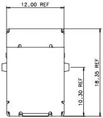
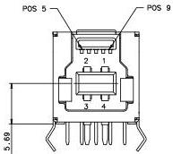
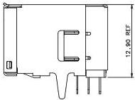

Universal Serial Bus 3.1 Specification, Revision 1.0

NOTES:

1) CRITICAL DIMENSIONS ARE TOLERANCED
AND SHALL NOT BE DEVIATED.

2) GENERAL TOLERANCE IS ±0.10 OTHERWISE
THE SPECIFIED TOLERANCE APPLIES.

3) ALL DIMENSIONS ARE IN MILLIMETERS.
4) DIMENSIONS THAT ARE LABELED REF ARE
TYPICAL DIMENSIONS AND MAY VARY FROM
MANUFACTURER TO MANUFACTURER.

5) NON-DIMENSIONED GEOMETRY FOR REFERENCE
ONLY, SUBJECT TO CHANGE.

Figure 5-9. USB 3.1 Standard-B Receptacle Interface Dimensions

5-22