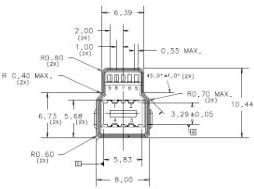
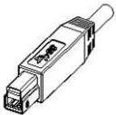
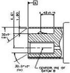
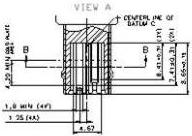
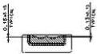
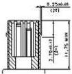

Mechanical

SECTION D-D

SECTION A-A

SECTION B-B

SECTION C-C

NOTES:

1) CRITICAL DIMENSIONS ARE TOLERANCED AND SHALL NOT BE DEVIATED.
2) GENERAL TOLERANCE IS ±0.10 OTHERWISE THE SPECIFIED TOLERANCE APPLIES.
3) ALL DIMENSIONS ARE IN MILLIMETERS.
4) DIMENSIONS THAT ARE LABELED REF ARE TYPICAL DIMENSIONS AND MAY VARY FROM MANUFACTURER TO MANUFACTURER.
5) NON-DIMENSIONED GEOMETRY FOR REFERENCE ONLY, SUBJECT TO CHANGE.
6) OVERALL CONNECTOR AND CABLE LENGTH IS MEASURED FROM DATUM A OF THE SERIES "B" PLUG TO DATUM A OF THE SERIES "A" PLUG OR BLUNT END TERMINATION.

Figure 5-10. USB 3.1 Standard-B Plug Interface Dimensions

5-23