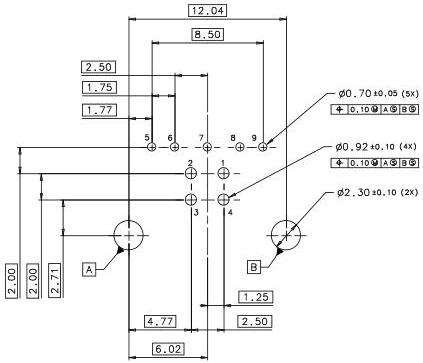

Universal Serial Bus 3.1 Specification, Revision 1.0

REFERENCE PCB LAYOUT

Figure 5-11. Reference Footprint for the USB 3.1 Standard-B Receptacle

The USB 3.1 Standard-B receptacle interfaces have two portions: the USB 2.0 interface and the SuperSpeed interface. The USB 2.0 interface consists of pins 1 to 4, while the SuperSpeed interface consists of pins 5 to 9.

When a USB 2.0 Standard-B plug is inserted into the USB 3.1 Standard-B receptacle, only the USB 2.0 interface is engaged and the link will not take advantage of the Enhanced SuperSpeed capability. Since the USB 3.1 SuperSpeed portion is visibly not mated when a USB 2.0 Standard-B plug is inserted in the USB 3.1 Standard-B receptacle, users have the visual feedback that the cable plug is not matched with the receptacle. Only when a USB 3.1 Standard-B plug is inserted into the USB 3.1 Standard-B receptacle, is the interface completely visibly engaged.

5-24