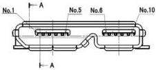
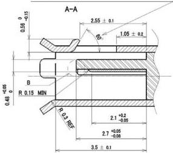
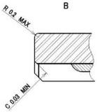
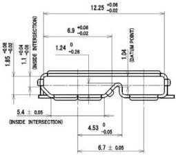
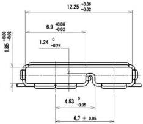

Mechanical

Subject to change by individual connector
manufacturer to assure specified performance
and intermateability.

KEY B
SHIELD DIMENSIONS

KEY AB
SHIELD DIMENSIONS

NOTE : Chamfer metals are optional with no sharp edges.

Figure 5-12. USB 3.1 Micro-B and -AB Receptacles Interface Dimensions

5-27