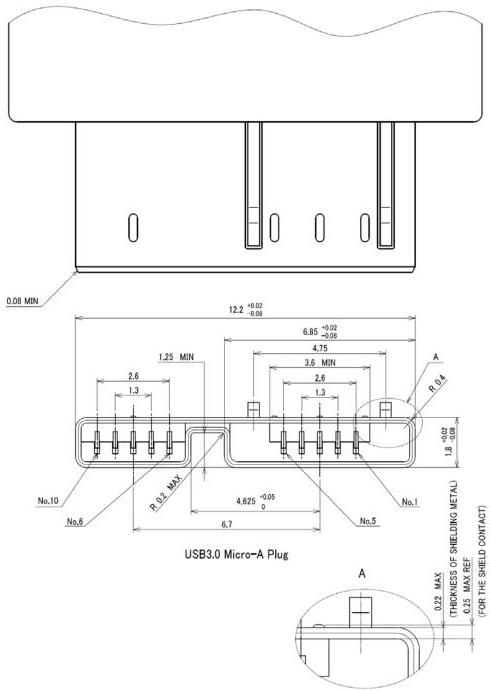

Mechanical

NOTES:

1. Dimensions that are labeled REF may vary from manufacturer to manufacturer.

2. General tolerance is +/-0.05mm, otherwise the specified tolerances apply.

Continued on next page

5-29