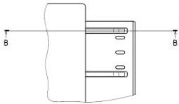
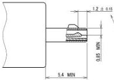
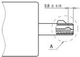
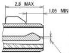
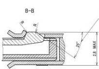

Universal Serial Bus 3.1 Specification, Revision 1.0

CONTACT No.2,3,4,6,7,9,10

A

CONTACT No.1,5,8

Each contact location (off-set value)
by zone 0.15 (+/-0.075)

The entry angle of the contact
shall not start above the top surfaces
of the adjacent insulator walls.

Subject to change by individual connector
manufacturer to assure specified performance
and intermateability.

Figure 5-13. USB 3.1 Micro-B and Micro-A Plug Interface Dimensions

5-30