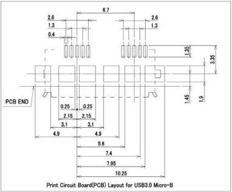
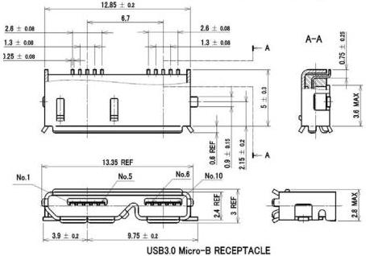

Mechanical

Standard-Surface Mount-Version Drawing

# NOTES :

1. Critical Dimensions are TOLERANCED and shall not be deviated.
2. Dimensions that labeled REF are typical dimensions and may vary from manufacturer to manufacturer.
3. General tolerance is \(+ / - 0.05\mathrm{mm}\) , otherwise the specified tolerances apply.
4. Chamfer metals are optional with no sharp edges.

Continued on next page

5-31