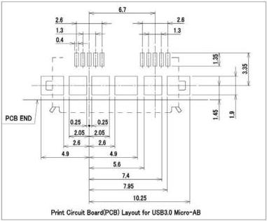
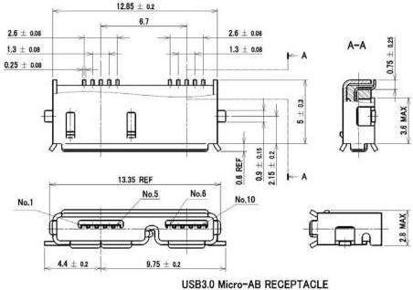

Universal Serial Bus 3.1 Specification, Revision 1.0

Standard-Surface Mount-Version Drawing

# NOTES :

1. Critical Dimensions are TOLERANCED and shall not be deviated.
2. Dimensions that labeled REF are typical dimensions and may vary from manufacturer to manufacturer.
3. General tolerance is +/- 0.05 mm, otherwise the specified tolerances apply.
4. Chamfer metals are optional with no sharp edges.

Figure 5-14. Reference Footprint for the USB 3.1 Micro-B or Micro-AB Receptacle

5-32