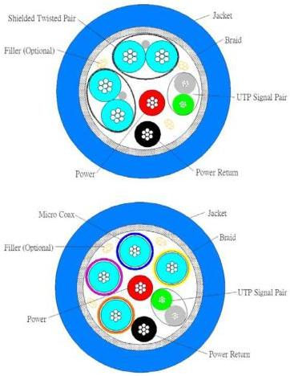

Universal Serial Bus 3.1 Specification, Revision 1.0

### 5.4.1 Cable Construction

Figure 5-15 illustrates a USB 3.1 cable cross-section. There are three groups of wires: D+/D-signal pair (typically unshielded twisted pair (UTP)), Enhanced SuperSpeed signal pairs (typically Shielded Differential Pair (SDP), twisted, twinax, or coaxial signal pairs), and power and ground wires.

Figure 5-15. Illustration of a USB 3.1 Cable Cross-Section

The D+/D- signal pair is intended to transmit the USB 2.0 signaling while the Enhanced SuperSpeed signal pairs are used for SuperSpeed; the shield is needed for the SuperSpeed differential pairs for signal integrity and EMI performance. Each Enhanced SuperSpeed drain wire is connected to the system ground through the GND_DRAIN pin(s) in the connector.

A metal braid is required to enclose all the wires in the USB 3.1 cable. The braid shall be terminated to the plug metal shells, as close to 360° as possible, to reduce EMI.

5-34