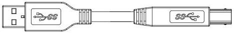
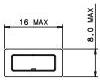
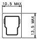
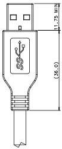
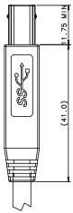

Mechanical

STANDARD "A" PLUG
(ALWAYS UPSTREAM TOWARDS
THE "HOST" SYSTEM)

STANDARD "B" PLUG
(ALWAYS DOWNSTREAM
TOWARDS THE USB DEVICE)

STANDARD "A" PLUG

STANDARD "B" PLUG

Figure 5-16. USB 3.1 Standard-A to USB 3.1 Standard-B Cable Assembly

Table 5-8 defines the wire connections for the USB 3.1 Standard-A to USB 3.1 Standard-B cable assembly.

5-37