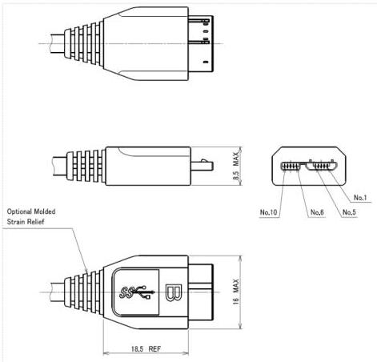

Mechanical

### 5.5.3 USB 3.1 Standard-A to USB 3.1 Micro-B Cable Assembly

Figure 5-17 shows the USB 3.1 Micro-B plug overmold dimensions for a USB 3.1 Standard-A to USB 3.1 Micro-B cable assembly. The USB 3.1 Standard-A plug overmold dimensions are found in Figure 5-16. Due to increased wire sizes required for some PD cable implementations, the overmold dimensions for PD cables have larger maximum dimensions than the non-PD cables specified. See the *Universal Serial Bus Power Delivery Specification* for the maximum overmold dimensions of PD cable assemblies.

Notes:

1. Any surface may have texturing up to 0.3 mm below the surface.

2. A square area around the letter B may be lowered as much as 0.5 mm.

3. USB authorized icon, connector type letter designation (i.e., B), color of the insulator body, and maximum dimensions are mandatory. Overmold outer configuration, color, and final shape are reference.

4. Pin 4 is not connected to pin 5 inside the plug.

Figure 5-17. USB 3.1 Micro-B Plug Cable Overmold Dimensions

5-39