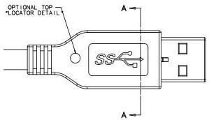
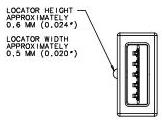
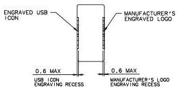

Universal Serial Bus 3.1 Specification, Revision 1.0

### 5.5.6 USB 3.1 Icon Location

USB 3.1 cable assemblies compliant with the USB 3.1 Connectors and Cable Assemblies Compliance Specification shall display the appropriate USB 3.1 Icon. A dimensioned drawing and allowable usage of the icon are supplied with the license from the USB-IF.

The USB 3.1 Icon is embossed in a recessed area on the side of the USB 3.1 plug. This provides easy user recognition and facilitates alignment during the mating process. The USB Icon and Manufacturer's logo should not project beyond the overmold surface. The USB 3.1 compliant cable assembly is required to have the USB 3.1 Icons on the plugs at both ends, while the manufacturer's logo is recommended. USB 3.1 receptacles should be orientated to allow the Icon on the plug to be visible during the mating process. Figure 5-19 shows a typical plug orientation.

SECTION A-A

Figure 5-19. Typical Plug Orientation

5-44