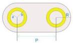
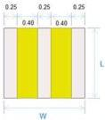
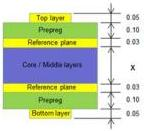

Mechanical

Example PTH

Example SMT pad

Example PCB stack-up

Note: See Section 5.6.1.3 for recommended electrical requirements in determining void dimensions

PTH for Standard A and B

[tbl-47.md](tbl-47.md)

SMT for Micro-B

[tbl-48.md](tbl-48.md)

Generic Stack-ups

Total thickness: 0.8 ~ 1.8 mm

Unit: mm

Figure 5-20. Recommended Ground Void Dimension for USB Standard-A Receptacle

### 5.6.1.2.1 Mated Connector Impedance for Gen 2 Speed

The recommended mated connector impedance is needed to maintain signal integrity. The differential impedance of a mated connector should be 90 Ω +/-10 Ω, as seen from a 40 ps (20%-80%) risetime of a differential TDR. The impedance profile of a mated connector should fall within the limits shown in Figure 5-21. The impedance profile of the mated connector is defined from the receptacle footprints through the plug cable termination area. In a case where the plug is directly attached to a device PCB, the mated connector impedance profile includes the path from the receptacle footprints to the plug footprints.

The normative cable assembly requirements are specified in Section 5.6.1.3.2.

5-47