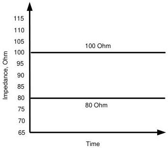

Universal Serial Bus 3.1 Specification, Revision 1.0

Figure 5-21. Impedance Limits of a Mated Connector for Gen 2 Speed

### 5.6.1.3 Mated Cable Assemblies for Gen 2 speed

The requirements for mated cable assemblies for Gen 2 speed are divided into informative and normative requirements. The informative requirements are provided as design targets and normative requirements are pass/fail criteria for mated cable assembly compliance testing.

#### 5.6.1.3.1 Design Targets

The design targets are summarized in Table 5-15. Cable assemblies that meet the target performance should pass the cable assembly compliance tests, but it is not guaranteed. Compliance is determined with the normative requirements.

5-48