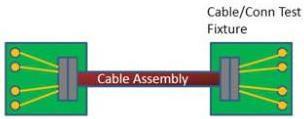

Mechanical

Table 5-15. Design Targets

[tbl-49.md](tbl-49.md)

### 5.6.1.3.2 Normative Requirements

The normative requirements manage the impact of insertion loss, multi-reflection, and crosstalk for the end-to-end link performance and mode conversion for EMI/RFI purposes.

#### 5.6.1.3.2.1 Test Fixtures

The mated cable assembly electrical requirements for Gen 2 speed are mostly specified in the frequency domain. To accurately measure the frequency response of the Gen 2 speed mated cable assembly, the fixture design and its performance characteristics are critical items. Common fixtures defined by the USB-IF or equivalent shall be used. Refer to USB 3.1 Connectors and Cable Assemblies Compliance Document for detailed descriptions of test fixtures. Figure 5-22 illustrates an example of a cable assembly mounted on a text fixture.

Figure 5-22. Illustration of Cable Assembly Mounted on Test Fixture

#### 5.6.1.3.2.2 Reference Hosts and Devices

To avoid channel margin loss associated with assigning interconnect budgets to the host, cable assembly, and device, the compliance of a Gen 2 speed cable assembly is established with reference hosts and reference devices to emulate the end-to-end condition as illustrated in Figure 5-23.

5-49