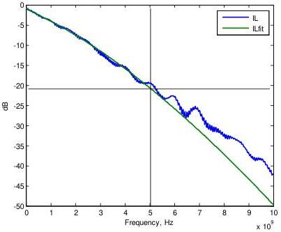

Mechanical

Figure 5-24. Illustration of Insertion Loss Fit at Nyquist Frequency

The difference between IL(f) and ILfit(f) is defined as the insertion loss deviation, ILD:

$$ILD(f) = IL(f) - ILfit(f). \tag{5-2}$$

It measures the ripple of the insertion loss, or the multi-reflection. Figure 5-25 shows an example of insertion loss deviation plotted against frequency.

5-51