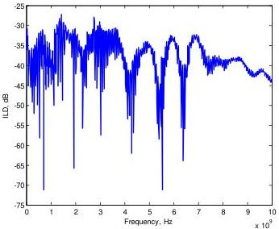
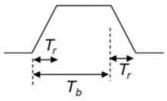

Universal Serial Bus 3.1 Specification, Revision 1.0

Figure 5-25. Example of Insertion Loss Deviation

The integrated multi-reflection, IMR, is calculated with the equation below:

$$IMR = \sqrt{\int_{0}^{f_{\max}} |ILD(f)|^2 |V_{in}(f)|^2 df / f_{Nq}} * 1000 \text{ (in mV)}, \tag{5-3}$$

where $f_{Nq}$ is the Nyquist frequency (5 GHz), $f_{\max}$ is chosen as the 2 times the Nyquist frequency (10 GHz), and $V_{in}(f)$ is the input trapezoidal pulse spectrum, defined as:

$$|V_{in}(\omega)| = \left| \frac{\sin\left(\frac{\omega T_r}{2}\right)}{\frac{\omega T_r}{2}} \cdot \frac{\sin\left(\frac{\omega T_b}{2}\right)}{\frac{\omega T_b}{2}} \right|$$

$$\begin{array}{l} T_b = \text{Unit Interval} = 100 \text{ ps} \\ T_c = \text{Rise time (0-100\%)} = 0.2 T_b \\ \omega = 2\pi f \end{array}$$

The integrated crosstalk, IXT, is defined as:

$$IXT = \sqrt{\int_{0}^{f_{\max}} |NEXT(f)|^2 |V_{in}(f)|^2 df / f_{Nq}} * 1000 \text{ (in mV)}, \tag{5-4}$$

5-52