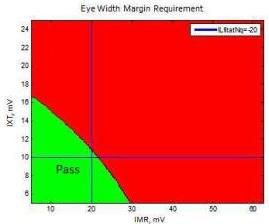
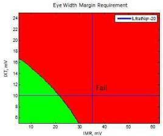
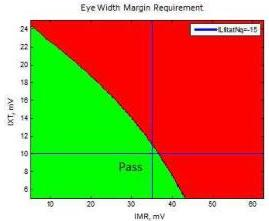
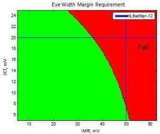

Universal Serial Bus 3.1 Specification, Revision 1.0

Figure 5-26. Pass/Fail Examples

The x-axis is IMR in mV and the y-axis is IXT in mV. The “green” part represents the passing region with open eyes, while the “red” area the failing region with closed eyes. The passing area increases as |ILfitatNq| decreases. This pass/fail criteria allows tradeoffs among ILfitatNq, IMR, and IXT. For example, a cable assembly may have more loss if IMR and/or IXT is smaller.

USB-IF provides a standard tool to calculate eH and eW based on the input cable assembly S-parameters. This tool, or an equivalent, is integrated into the USB SuperSpeed Gen 2 compliance test suite in the USB CabCon compliance program.

### 5.6.1.3.2.5 Differential Crosstalk between D+/D- and SuperSpeed Gen 2 Signal Pairs (EIA-360-90)

The differential near-end crosstalk (DDNEXT) and far-end crosstalk (DDFEXT between the D+/D-pair and the SuperSpeed Gen 2 signal pairs shall be measured in time domain with a rise time of 500 ps (10-90%) entering the connector under test. The mated cable assembly meets the DDNEXT/DDFEXT requirement if its peak-to-peak value does not exceed the limits below (see Figure 5-27 for illustration of the peak-to-peak crosstalk):

- USB 3.1 Standard-A connector: 2%

5-54