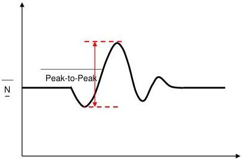

Mechanical

- USB 3.1 Standard-B connector: 2%
- USB 3.1 Micro connector family: 2%

Figure 5-27. Illustration of Peak-to-Peak Crosstalk

### 5.6.1.3.2.6 Differential to Common Mode Conversion

The differential to common mode conversion (SCD21 or SCD12) does not require embedding the reference host and the reference device with the mated cable assembly; it is for the mated cable assembly only. A mated cable assembly passes the SCD12 requirement if its SCD12 is less than or equal to -20 dB across the frequency range of 100MHz to 10 GHz, as shown in Figure 5-28.

5-55