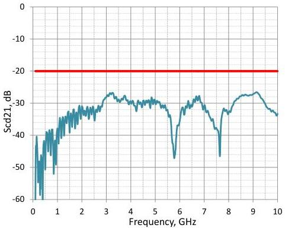
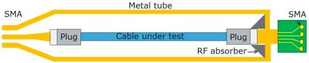

Universal Serial Bus 3.1 Specification, Revision 1.0

Figure 5-28. Differential-to-Common-Mode Conversion Requirement for Gen 2

### 5.6.1.3.2.7 Cable Shielding Effectiveness

The cable assembly shielding effectiveness (SE) test measures the radio frequency interference (RFI) level from the cable assembly. To perform the measurement, the cable assembly shall be installed in the cable SE test fixture as shown in Figure 5-29. The coupling factors from the cable to the fixture are characterized. The Cable SE test fixtures and specification values are under development and are to be included in future updates to this specification.

Figure 5-29. Set Up For Cable SE Measurement (subject to change)

5-56