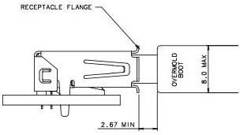

Mechanical

## 5.8 Implementation Notes and Design Guides

This section discusses a few implementation notes and design guides to help users design and use the USB 3.1 connectors and cables.

### 5.8.1 Mated Connector Dimensions

Figure 5-31, Figure 5-32, and Figure 5-33 show the mated plugs and receptacles for the USB 3.1 Standard-A, USB 3.1 Standard-B, and USB 3.1 Micro connectors, respectively. The distance between the receptacle front surface and the cable overmold should be observed by system designers to avoid interference between the system enclosure and the cable plug overmold.

Provisions shall be made in connectors and chassis to ground the connector metal shells to the metal chassis to reduce EMI and RFI.

FULLY MATED PLUG AND RECEPTACLE

Figure 5-31. Mated USB 3.1 Standard-A Connector

5-63