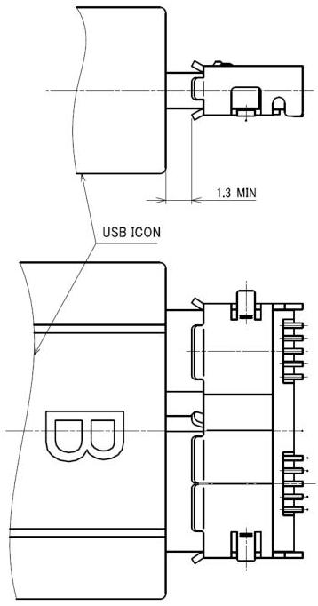

Mechanical

Figure 5-33. Mated USB 3.1 Micro-B Connector

### 5.8.2 EMI and RFI Management

Systems that include USB 3.1 connectors and cable assemblies need to meet the relevant EMI/EMC regulations.

5-65