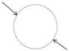
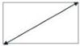

Universal Serial Bus 3.1 Specification, Revision 1.0

Connector and cable assembly designers, as well as system implementers should pay attention to receptacle and cable plug shielding to ensure a low-impedance grounding path. The following are guidelines for EMI and RFI management:

- The quality of raw cables should be ensured. The intra-pair skew or the differential to common mode conversion of the SuperSpeed pairs has a significant impact on cable EMI performance and should be controlled within the limits of this specification.
- The cable external braid should be terminated to the cable plug metal shell as close to 360° as possible. Without appropriate shielding termination, even a perfect cable with zero intra-pair skew may not meet EMI requirements.
- The wire termination contributes to the differential-to-common-mode conversion. The breakout distance for the wire termination should be kept as small as possible for EMI, RFI, and signal integrity. If possible, symmetry should be maintained for the two lines within a differential pair.
- The mating interface between the receptacle and cable plug should have a sufficient number of grounding fingers, or springs, to provide a continuous return path from the cable plug to system ground. Friction locks should not compromise ground return connections.
- The receptacle connectors should be designed with a back-shield as part of the receptacle connector metal shell. The back-shield should have connections to adjacent shell surfaces and provide multiple connections for ground termination. The back-shield should be designed with a short return path to the chassis ground.
- The receptacle connectors should be connected to metal chassis or enclosures through grounding fingers, screws, or any other way to mitigate EMI and RFI.
- Plug connectors should have back-shields when possible.
- Outer connector shell surfaces in the mated configuration should have a maximum aperture size of 2 mm. This applies to both mounted connectors (e.g., soldered to a circuit board) and connectors used in cable assemblies. See Figure 5-34.

Aperture

Aperture

Aperture

Figure 5-34. Examples of Connector Apertures

5-66