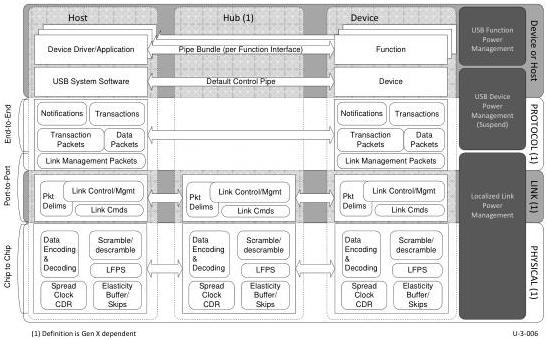

6

Physical Layer

Figure 6-1. SuperSpeed Physical Layer

## 6.1 Physical Layer Overview

The physical layer defines the signaling technology for the SuperSpeed and SuperSpeedPlus busses. This chapter defines the electrical requirements of the SuperSpeed and SuperSpeedPlus physical layers.

This section defines the electrical-layer parameters required for operation of SuperSpeed and SuperSpeedPlus components. Normative specifications are required. Informative specifications may assist product designers and testers in understanding the intended behavior of the SuperSpeed and SuperSpeedPlus busses.

## 6.2 Physical Layer Functions

The functions of the physical layer are shown in Figure 6-2, Figure 6-3, Figure 6-4, and Figure 6-5.

6-1