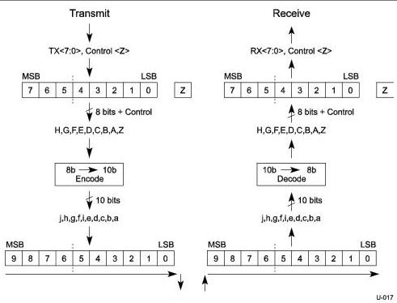

Universal Serial Bus 3.1 Specification, Revision 1.0

### 6.2.2 Channel Overview

A PHY is a transmitter and receiver that operate together and are located on the same component. A channel connects two PHYs together with two unidirectional differential pairs of pins for a total of four wires. The PHYs are required to be AC coupled. The AC coupling capacitors are associated with the transmitter.

## 6.3 Symbol Encoding

### 6.3.1 Gen 1 Encoding

The Gen 1 PHY uses the 8b/10b transmission code. The definition of this transmission code is identical to that specified in ANSI X3.230-1994 (also referred to as ANSI INCITS 230-1994), clause 11. As shown in Figure 6-6, ABCDE maps to abcdei and FGH maps to fghj.

Figure 6-6. Character to Symbol Mapping

#### 6.3.1.1 Serialization and Deserialization of Data

The bits of a Symbol are placed starting with bit “a” and ending with bit “j.” This is shown in Figure 6-7.

6-6