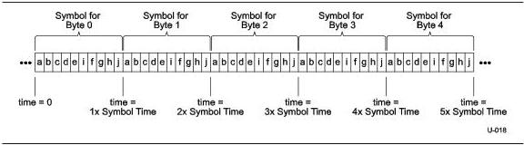

Physical Layer

Figure 6-7. Bit Transmission Order

### 6.3.1.2 Normative 8b/10b Decode Rules for Gen 1 Operation

1. A Transmitter is permitted to pick any disparity when first transmitting differential data after being in an Electrical Idle state. The Transmitter shall then follow proper 8b/10b encoding rules until the next Electrical Idle state is entered.
2. The initial disparity for a Receiver is the disparity of the first Symbol used to obtain Symbol lock.
3. Disparity may also be-reinitialized if Symbol lock is lost and regained during the transmission of differential information due to a burst error event.
4. All following received Symbols after the initial disparity is set shall be in the proper column corresponding to the current running disparity.
5. Receive disparity errors do not directly cause the link to retrain.
6. If a disparity error or 8b/10 Decode error is detected, the physical layer shall inform the link layer.

### 6.3.1.3 Gen 1 Data Scrambling

The scrambling function is implemented using a free running Linear Feedback Shift Register (LFSR). On the Transmit side, scrambling is applied to characters prior to the 8b/10b encoding. On the receive side, descrambling is applied to characters after 8b/10b decoding. The LFSR is reset whenever a COM symbol is sent or received.

The LFSR is graphically represented in Figure 6-8. Scrambling or unscrambling is performed by serially XORing the 8-bit (D0-D7) character with the 16-bit (D0-D15) output of the LFSR. An output of the LFSR, D15, is XORed with D0 of the data to be processed. The LFSR and data register are then serially advanced and the output processing is repeated for D1 through D7. The LFSR is advanced after the data is XORed.

The mechanism to notify the physical layer to disable scrambling is implementation specific and beyond the scope of this specification.

The data scrambling rules are as follows:

1. The LFSR implements the polynomial: $$G(X)=X^{16}+X^{5}+X^{4}+X^{3}+1$$
2. The LFSR value shall be advanced eight serial shifts for each Symbol except for SKP.
3. All 8b/10b D-codes, except those within the Training Sequence Ordered Sets shall be scrambled.
4. K codes shall not be scrambled.

6-7