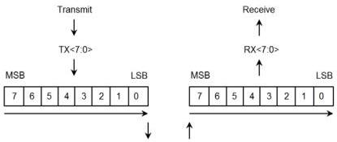
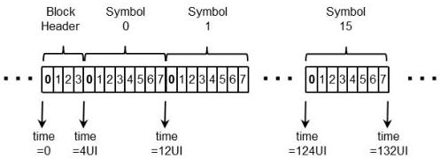

Physical Layer

Figure 6-9. Gen 2 Serialization and Deserialization Order

Figure 6-10. Gen 2 Bit Transmission Order and Framing

### 6.3.2.2 Normative 128b/132b Decode Rules

The physical layer shall encode the data on a per block basis. Each block shall comprise a 4-bit Block Header and a 128-bit payload. The 4-bit header is set to 0011b for data and 1100b for control blocks. This header format allows for the correction of single bit errors in the header information.

Ordered sets are control blocks, and all data is sent in data blocks. The following is a list of the control blocks.

- TS1 Ordered Set
- TS2 Ordered Set

6-9