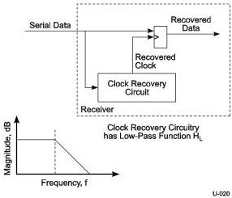

Physical Layer

TR-35-2004, INCITS Technical Report for Information Technology – Fibre Channel – Methodologies for Jitter and Signal Quality Specification (FC-MJSQ).

The clock recovery function is given by Equations 1-3. A schematic of the general clock recovery function is shown in Figure 6-12. As shown, the clock recovery circuit has a low pass response. After the recovered clock is compared (subtracted) to the data, the overall clock recovery becomes a high pass function. This is shown with the appropriate bandwidths in Figure 6-13 for Gen 1 operation and in Figure 6-14 for Gen 2 operation.

Figure 6-12. Jitter Filtering – “Golden PLL” and Jitter Transfer Functions

6-23