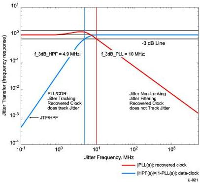
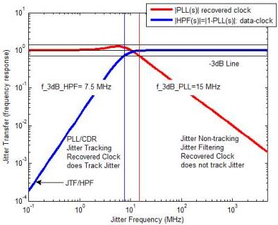

Universal Serial Bus 3.1 Specification, Revision 1.0

Figure 6-13. "Golden PLL" and Jitter Transfer Functions for Gen 1 Operation

Figure 6-14. "Golden PLL" and Jitter Transfer Functions for Gen 2 Operation

6-24