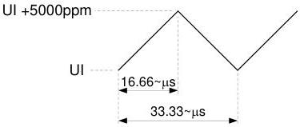

Universal Serial Bus 3.1 Specification, Revision 1.0

Figure 6-15. Example of Period Modulation from Triangular SSC

### 6.5.4 Normative Slew Rate Limit

The CDR is a slew rate limited phase tracking device. The combination of SSC and all other jitter sources within the bandwidth of the CDR shall not exceed the maximum allowed slew rate.

This measurement is performed by filtering the phase jitter with the CDR transfer function and taking the first difference of the phase jitter to obtain the filtered period jitter. The peak of the period jitter shall not exceed TCDR_SLEW_MAX listed in Table 6-17.

Additional details on the slew rate measurement are available in the white paper titled USB 3.0 Jitter Budgeting.

## 6.6 Signaling

### 6.6.1 Eye Diagrams

The eye diagrams are a graphical representation of the voltage and time limits of the signal. This eye mask applies to jitter after the application of the appropriate jitter transfer function and reference receiver equalization. In all cases, the eye is to be measured for 10⁶ consecutive UI. The budget for the link is derived assuming a total 10⁻¹² bit error rate and is extrapolated to a measurement of 10⁶ UI assuming the random jitter is Gaussian.

Figure 6-16 shows the eye mask used for all eye diagram measurements. Referring to the figure, the time is measured from the crossing points of Txp/Txn. The time is called the eye width, and the voltage is the eye height. The eye height is to be measured at the maximum opening (at the center of the eye width ± 0.05 UI). Specific eye mask requirements are defined in Table 6-19.

The eye diagrams are to be centered using the jitter transfer function (JTF). The recovered clock is obtained from the data and processed by the JTF. The center of the recovered clock is used to position the center of the data in the eye diagram.

The eye diagrams are to be measured into 50-Ω single-ended loads.

6-26