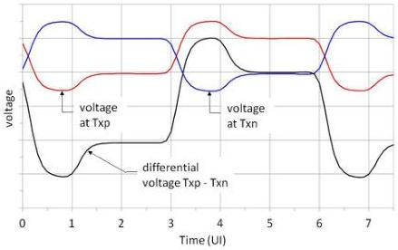

Universal Serial Bus 3.1 Specification, Revision 1.0

### 6.6.2 Voltage Level Definitions

Referring to Figure 6-17, the differential voltage, $V_{DIFF}$, is the voltage on Txp (Rxp at the receiver) with respect to Txn (Rxn at the receiver). $V_{DIFF}$ is the same voltage as the swing on the single signal of one conductor. The differential voltage is

(4) $V_{DIFF} = Txp - Txn$

The total differential voltage swing is the peak to peak differential voltage, $V_{DIFF-PP}$. This is twice the differential voltage. The peak to peak differential voltage is

(5) $V_{DIFF-PP} = 2 * V_{DIFF}$

The Common Mode Voltage ($V_{CM}$) is the average voltage present on the same differential pair with respect to ground. This is measured, with respect to ground, as

(6) $V_{CM} = (Txp + Txn) / 2.$

DC is defined as all frequency components below $F_{DC} = 30$ kHz. AC is defined as all frequency components at or above $F_{DC} = 30$ kHz. These definitions pertain to all voltage and current specifications.

An example waveform is shown in Figure 6-17. In this waveform, the peak-to-peak differential voltage, $V_{DIFF-PP}$ is 800 mV. The differential voltage, $V_{DIFF}$, is 400 mVPP. Note that while the center crossing point for both Txp and Txn is shown at 300 mV, the corresponding crossover point for the differential voltage is at 0.0 V. The center crossing point at 300 mV is also the common mode voltage, $V_{CM}$. Note these waveforms include de-emphasis. The actual amount of de-emphasis can vary depending on the transmitter setting according to the allowed ranges in Table 6-17.

Figure 6-17. Single-ended and Differential Voltage Levels

6-28