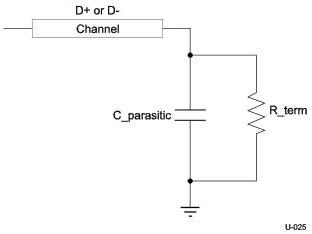

Physical Layer

### 6.6.3 Tx and Rx Input Parasitics

Tx and Rx input parasitics are specified by the lumped circuit shown in Figure 6-18.

Figure 6-18. Device Termination Schematic

In this circuit, the input buffer is simplified to a termination resistance in parallel with a parasitic capacitor. This simplified circuit is the load impedance.

6-29