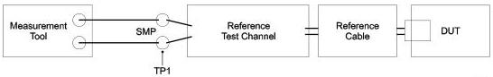

Universal Serial Bus 3.1 Specification, Revision 1.0

### 6.7.3 Transmitter Eye

The eye mask is measured using the compliance data patterns as described in Section 6.4.3.2. The transmitter compliance test for Gen 1 uses compliance patterns CP0 and CP1 for TJ and RJ, respectively. The transmitter compliance test for Gen 2 uses compliance patterns CP9 and CP10 for TJ and RJ, respectively. Eye height is measured for 10⁶ consecutive UI. Jitter is extrapolated from 10⁶ UI to 10⁻¹² BER.

Table 6-19. Normative Transmitter Eye Mask at Test Point TP1

[tbl-72.md](tbl-72.md)

Notes:

1. Measured over 10⁶ consecutive UI and extrapolated to 10⁻¹² BER.

2. Measured after receiver equalization function.

3. Measured at end of reference channel and cables at TP1 in Figure 6-19.

4. The eye height is to be measured at the minimum opening over the range from the center of the eye ± 0.05 UI.

5. The Rj specification is calculated as 14.069 times the RMS random jitter for 10⁻¹² BER.

The compliance testing setup is shown in Figure 6-19. All measurements are made at the test point (TP1), and the Tx specifications are applied after processing the measured data with the compliance reference equalizer transfer function described in the next section.

U-026

Figure 6-19. Tx Normative Setup with Reference Channel

### 6.7.4 Tx Compliance Reference Receiver Equalize Function

The normative transmitter eye is captured at the end of the reference channel. At this point the eye may be closed. To open the eye so it can be measured a reference Rx equalizer, is applied to the signal. Details of the reference equalizer are contained in Section 6.8.2.

6-32