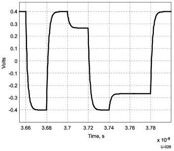

Physical Layer

### 6.7.5 Informative Transmitter De-emphasis

#### 6.7.5.1 Gen 1 (5GT/s)

The channel budgets and eye diagrams were derived using a V_TX-DE-RATIO of transmit de-emphasis for both the Host and the Device reference channels. An example differential peak-to-peak de-emphasis waveform is shown in Figure 6-20.

Figure 6-20. De-Emphasis Waveform

#### 6.7.5.2 Gen 2 (10GT/s)

Gen 2 transmitters employ a 3-tap FIR-based equalizer, the structure of which is shown in Figure 6-21. An example waveform from the 3-tap equalizer is shown in Figure 6-22. In the figure, the pre-cursor (Vc) is referred to as pre-shoot, while the post-cursor (Vb) is referred to as de-emphasis. This convention allows pre-shoot and de-emphasis to be defined independently of one another. The maximum swing, Vd, is also shown to illustrate that, when both C+1 and C-1 are nonzero, the swing of Va does not reach the maximum as defined by Vd. Figure 6-22 is shown as an example of TxEQ and is not intended to represent the signal as it would appear for measurement purposes.

Table 6-20 provides recommended (informative) tap coefficient values (C-1 and C1) along with the corresponding pre-shoot, de-emphasis and output amplitudes. The host/device loss referred to in the table refers to the differential insertion loss in the conductor path from the silicon die pad to the connector, and includes parasitic I/O capacitance, the chip package (routing, vias and I/O pins), and printed circuit board (routing and vias).

6-33