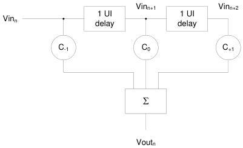
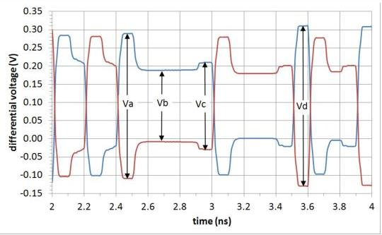

Universal Serial Bus 3.1 Specification, Revision 1.0

Figure 6-21. 3-tap Transmit Equalizer Structure

Preshoot = 20log(Vc/Vb)
De-emphasis = 20log(Vb/Va)

Figure 6-22. Example Output Waveform for 3-tap Transmit Equalizer

6-34