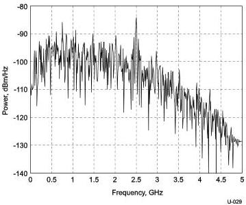

Universal Serial Bus 3.1 Specification, Revision 1.0

Figure 6-23. Frequency Spectrum of TSEQ

### 6.8.2 Informative Receiver CTLE Function

USB 3.1 allows the use of receiver equalization to meet system timing and voltage margins. For long cables and channels the eye at the Rx is closed, and there is no meaningful eye without first applying an equalization function. The Rx equalizer may be required to adapt to different channel losses using the Rx EQ training period. The exact Rx equalizer and training method is implementation specific.

#### 6.8.2.1 Gen 1 Reference CTLE

The equation for the continuous time linear equalizer (CTLE) used to develop the specification is the compliance Rx EQ transfer function described below.

$$H(s) = \frac{A_{dc} \omega_{p1} \omega_{p2}}{\omega_z} \cdot \frac{s + \omega_z}{(s + \omega_{p1})(s + \omega_{p2})}$$

where $A_{dc}$ is the DC gain

$\omega_z = 2\pi f_z$ is the zero frequency

$\omega_{p1} = 2\pi f_{p1}$ is the first pole frequency

$\omega_{p2} = 2\pi f_{p2}$ is the second pole frequency

Figure 6-24 is a plot of the Compliance EQ transfer functions with the values for each of the input parameters.

6-36