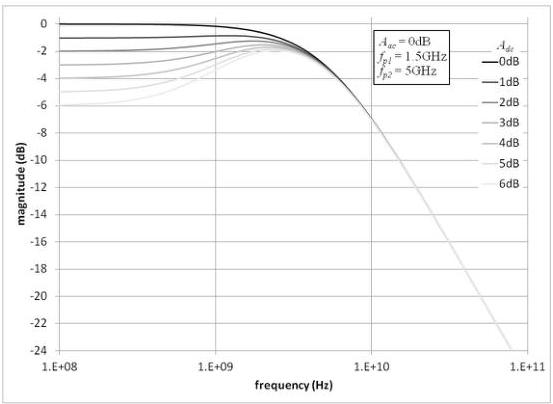

Universal Serial Bus 3.1 Specification, Revision 1.0

Figure 6-25 is a plot of the Compliance EQ transfer functions with the values for each of the input parameters.

Figure 6-25. Gen 2 Compliance Rx EQ Transfer Function

### 6.8.2.2.2 Reference DFE

In addition to the 1st order CTLE, a one-tap reference DFE is used in transmitter compliance testing. The DFE behavior is described by equation (12) and Figure 6-26. The limits on dI are 0 to 50mV.

(12) $$y_k = x_k - d_1 \operatorname{sgn}(y_{k-1})$$

where yk is the DFE differential output voltage

y*k is the decision function output voltage, |y*k| = 1

xk is the DFE differential input voltage

dI is the DFE feedback coefficient

k is the sample index in UI

6-38