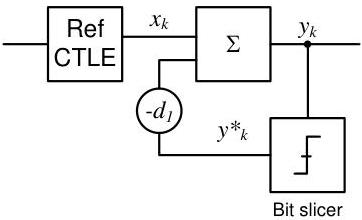

Physical Layer

Figure 6-26. Gen 2 reference DFE Function

### 6.8.3 Receiver Electrical Parameters

Normative specifications are to be measured at the connector. Peak (p) and peak- peak (p-p) are defined in Section 6.6.2.

Table 6-21. Receiver Normative Electrical Parameters

[tbl-74.md](tbl-74.md)

Note

1. Only DC Input CM Input Impedance for V >0 is specified. DC Input CM Input Impedance for V <0 is not guaranteed and could be as low as 0 Ω.

The values in Table 6-22 are informative and not normative. They are included in this document to provide some guidance beyond the normative requirements in Table 6-21 for receiver design and development. A receiver can be fully compliant with the normative requirements of the

6-39