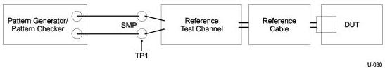
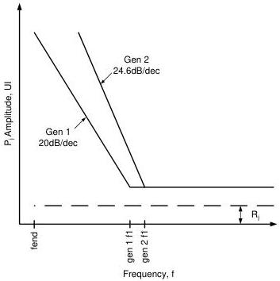

Universal Serial Bus 3.1 Specification, Revision 1.0

### 6.8.5 Normative Receiver Tolerance Compliance Test

The receiver tolerance test is tested using the appropriate compliance reference channel for Gen 1 or Gen 2 operation depending upon the rate being tested. A pattern generator shall send the rate appropriate compliance test pattern with added jitter through the compliance reference channels to the receiver. The receiver shall loop back the data and any difference in the pattern sent from the pattern generator and returned will be an error. When running the compliance tests, the receiver shall be put into loopback mode.

Additional details on the receiver compliance test are contained in the reference document, USB SuperSpeed Compliance Methodology.

Figure 6-27. Rx Tolerance Setup

Figure 6-28. Jitter Tolerance Curve

6-42