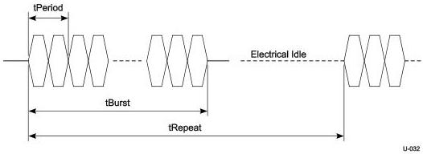

Universal Serial Bus 3.1 Specification, Revision 1.0

An LFPS message is encoded based on the variation of tBurst. tRepeat is defined as a time interval when the next LFPS message is transmitted. The LFPS messages include Polling.LFPS and Ping.LFPS, as defined in Table 6-29. There are also LFPS signaling defined by a for U1/U2 and Loopback exit, U3 wakeup, and Warm Reset.

The detailed use of LFPS signaling is specified in the following sections and Chapter 7.

Figure 6-29. LFPS Signaling

Table 6-28. Normative LFPS Electrical Specification

[tbl-82.md](tbl-82.md)

6-44