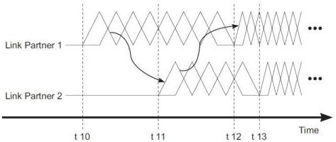

Universal Serial Bus 3.1 Specification, Revision 1.0

### 6.9.2 Example LFPS Handshake for U1/U2 Exit, Loopback Exit, and U3 Wakeup

The LFPS signal used for U1/U2 exit, Loopback exit, and U3 wakeup is defined the same as continuous LFPS signals with the exception of timeout values defined in Table 6-30. The handshake process for U1/U2 exit and U3 wakeup is illustrated in Figure 6-30. The timing requirements are different for U1 exit, U2 exit, Loopback exit, and U3 wakeup. They are listed in Table 6-30.

t10 – When Link Partner 1 starts to transmit LFPS, in initiating exit from either U1/U2/U3/Loopback.
t11 – When Link Partner 2 validates the received LFPS for the required t11-t10 duration and starts to transmit LFPS in response.
t12 – When Link Partner 1 validates the received LFPS of the required t12-t11 and t12-t10 durations and starts to transmit SS signaling.
t13 – When Link Partner 2 transmits LFPS of meeting the required t13-t11 duration and starts to transmit SS signaling.

U-033A

Figure 6-30. U1 Exit, U2 Exit, and U3 Wakeup LFPS Handshake Timing Diagram

Note: the timing diagram in Figure 6-22 is for illustration of the LFPS handshake process only.

The handshake process is as follows:

- Link partner 1 initiates exit by transmitting LFPS at time t10 (see Figure 6-30). LFPS transmission shall continue until the handshake is declared either successful or failed.
- Link partner 2 detects valid LFPS on its receiver and responds by transmitting LFPS at time t11. LFPS transmission shall continue until the handshake is declared either successful or failed.
- A successful handshake is declared for link partner 1 if the following conditions are met within “tNoLFPSResponseTimeout” after t10 (see Figure 6-30 and Table 6-30):

1. Valid LFPS is received from link partner 2.

Note: in case of concurrent U1 exit, where both ports initiate U1 exit simultaneously, both ports will assume to be Link partner 1. Both ports will start receiving LFPS signal before

6-46