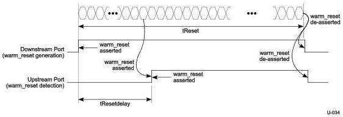

Universal Serial Bus 3.1 Specification, Revision 1.0

Essentially, t12-t10 of link partner 1 follows U1 Exit tBurst timing and t13-t11 of link partner 2 follows U2 Exit tBurst timing.

### 6.9.3 Warm Reset

A Warm Reset is a reset generated only by a downstream port to an upstream port. A downstream port may issue a Warm Reset at any Link states except SS.Disabled. An upstream port is required to detect a Warm Reset at any link states except SS.Disabled.

Note: Warm Reset is defined to be able to reset a hardware failure of a device, such as the LTSSM hanging. Under this assumption, Warm Reset may be detected in any link states except SS.Disabled.

A Warm Reset shares the same continuous LFPS signal as a low power Link state exit handshake signal. In order for an upstream port to be able to differentiate between the two signals, the tBurst of a Warm Reset is extended, as is defined in Table 6-20.

The Warm Reset assertion is asynchronous between a downstream port and an upstream port since it has to take a certain period of time for an upstream port to declare that a Warm Reset is detected. However, the de-assertion of the Warm Reset between a downstream port and an upstream port shall be made synchronous. Figure 6-31 shows a timing diagram of Warm Reset generation and detection when a port is U3. Once a Warm Reset is issued by a downstream port, it will take at least tResetDelay for an upstream port to declare the detection of Warm Reset. Once a Warm Reset is detected, an upstream port shall continue to assert the Warm Reset until it no longer receives any LFPS signals from a downstream port.

- An upstream port shall declare the detection of Warm Reset within tResetDelay. The minimum tResetDelay shall be 18 ms; the maximum tResetDelay shall be 50 ms.

Figure 6-31. Example of Warm Reset Out of U3

### 6.9.4 SuperSpeedPlus Capability Declaration

SuperSpeedPlus Capability Declaration (SCD) is a step for a SuperSpeedPlus port, while in the Polling.LFPS substate, to identify itself as SuperSpeedPlus capable by transmitting Polling.LFPS signals with specific patterns unique to SuperSpeedPlus ports. This section defines SuperSpeedPlus specific patterns in SCD1 and SCD2. The use of SCD1 and SCD2 is described in Chapter 7.

6-48