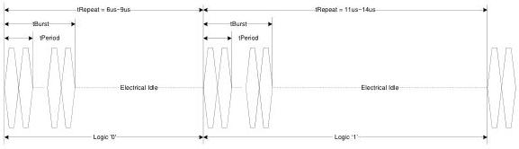

Physical Layer

### 6.9.4.1 Binary Representation of Polling.LFPS

Binary representation of Polling.LFPS refers to logic presentation based on Polling.LFPS signal by the measure of tRepeat duration. As shown in Table 6-31, logic '0' is represented with tRepeat varying between 6~9us, and logic '1' is represented with tRepeat varying between 11~14us. tRepeat between 9~11us is defined as a guard band.

Figure 6-32 is an example of Polling.LFPS based binary representation in the time domain.

Table 6-31. Binary Representation of Polling.LFPS

[tbl-85.md](tbl-85.md)

Figure 6-32. Example of Binary Representation based on Polling.LFPS

### 6.9.4.2 SCD1/SCD2 Definitions and Transmission

SCD1 is defined as "0010" and SCD2 is defined as "1101". The transmission of SCD1/SCD2 shall be based on the following.

- The transmission shall be LSb first, and consecutive SCD1/SCD2 shall be transmitted back to back.
- The transmission shall be completed with and extra tBurst followed by electrical idle (EI) of at least 2x the maximum allowable tRepeat value.

Figure 6-33 is an example of SCD1/SCD2 waveform in the time domain.

6-49